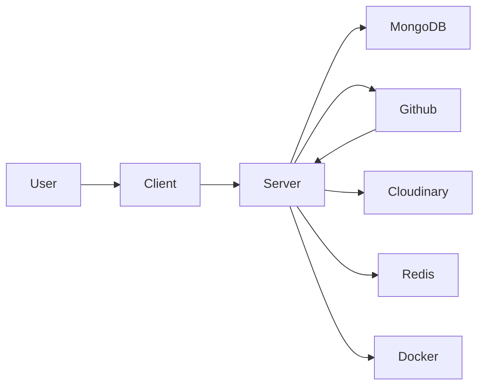
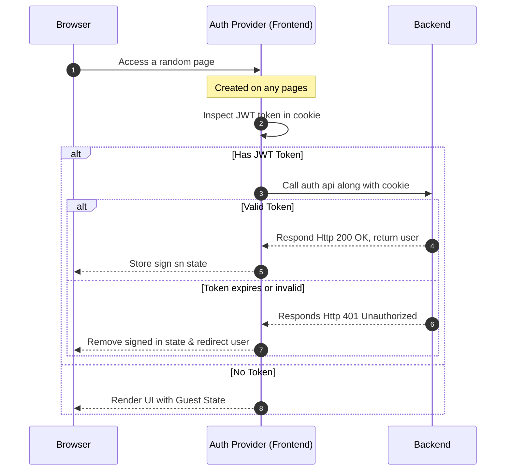

# System Design

## Architecture

```mermaid
flowchart LR
User --> Client
Client --> Server
Server --> MongoDB
Github --> Server
Server --> Github
Server --> Cloudinary
Server --> Redis
Server --> Docker
```

## Request Flow

## Authentication Flow

```mermaid
sequenceDiagram
    autonumber
    participant Browser
    participant AuthProvider as Auth Provider (Frontend)
    participant Backend

    Browser->>AuthProvider: Access a random page
    Note over AuthProvider: Created on any pages

    AuthProvider->>AuthProvider: Inspect JWT token in cookie

    alt Has JWT Token
        AuthProvider->>Backend: Call auth api along with cookie

        alt Valid Token
            Backend-->>AuthProvider: Respond Http 200 OK, return user
            AuthProvider-->>Browser:Store sign sn state
        else Token expires or invalid
            Backend-->>AuthProvider: Responds Http 401 Unauthorized
            AuthProvider-->>Browser: Remove signed in state & redirect user
        end

    else No Token
        AuthProvider-->>Browser: Render UI with Guest State
    end
```

## Deployment Flow

<!-- lam ro phan nay nhe b-->
